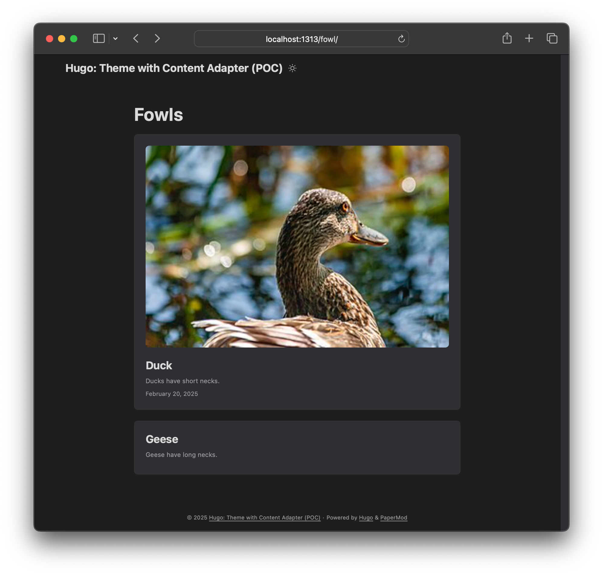

# Hugo: Theme with Content Adapter (POC)

This repo is an experiment to get [Hugo Content Adapters](https://gohugo.io/content-management/content-adapters/)
working with an off-the-shelf theme (the excellent [PaperMod](https://github.com/adityatelange/hugo-PaperMod), but
I could have used practically any theme).

## Version Info

I am using `hugo v0.143.1+extended+withdeploy darwin/amd64 BuildDate=2025-02-04T08:57:38Z VendorInfo=brew`.

## Background

This site generates two pages:

* `public/fowl/ducks/index.html` (from `content/fowl/ducks.md`)
* `public/fowl/geese/index.html` (from `content/fowl/_content.gotmpl`, which uses `data/fowl.yaml` as a data source)

But as you can see in the screenshot (or by cloning this repo and
running `hugo server`), the page generated via `_content.gotmpl` in
incomplete: It is missing the cover image and the date.

